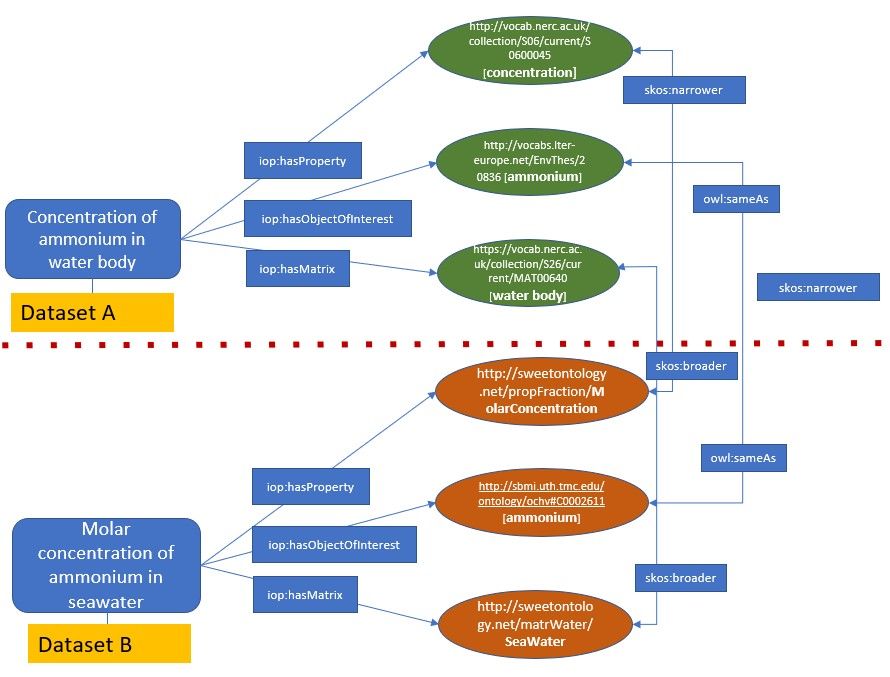
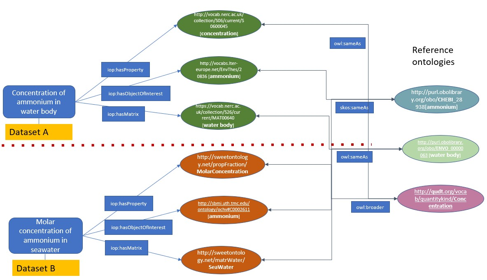
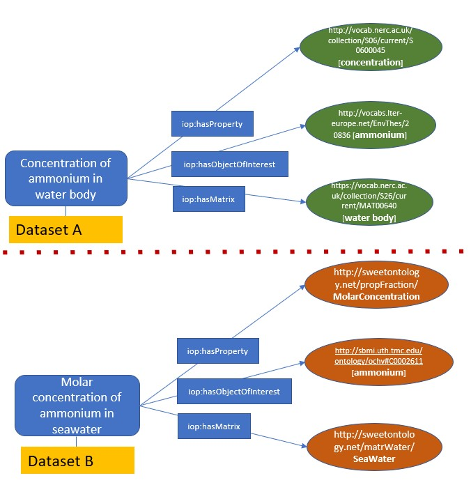

Making it possible to specify I-ADOPT as a mapping framework and the specific conditions under which a mapping is based on

### Domain

Potentially any domain, but with an initinal focus on the environmental domain

### Purpose of the mapping

I-ADOPT is a mapping framework that allows to compare two different observational datasets by decomposing their observable properties into atomic components that play specific roles in the description. These components can be mapped to each other using different mapping conditions.

### Type of mapped resources

- SKOS concepts describing composite variables and their components. This case study has different user stories:

**Case study 1: direct mappings of description components**

Mapping of two datasets using their variable descriptions based on the fact that both variable concepts have been mapped to the same description components using the I-ADOPT object properties.

**Use case 2: Indirect mappings of description components**

2a: related mappings of description components:

Mapping of two datasets using their variable descriptions based on the fact that both have been mapped to atomic concepts that are related to each others by existing mappings.

2b: description components mapped to the same reference semantic artefacts

Mapping of two datasets using their variable descriptions based on the fact that their atomic concepts have not been mapped to each other but mapped to common reference ontologies.

2 c: no explicit mappings existing, but automatic mappings based on term matches

Mapping of two datasets using their variable descriptions based on automatic mappings of their atomoic concepts. 

**Use case 3: Description components mapped between a variable and a blank node**

Mapping of two datasets based on the fact that they are annotated with the same description components using the I-ADOPT object properties, but one dataset has a composite variable concept and the other is described directly by its description component.

### Links to an existing mappings

- [https://vocab.nerc.ac.uk/mapping/I/1740186/](https://vocab.nerc.ac.uk/mapping/I/1740186/)

  Other mappings will follow after a basic agreement how to create FAIR mappings for I-ADOPT variables.

### Tools used for creating the mapping

For now we are using a manual procedure. Howeever, we are developing SQPARQL queries to perform mappings. Moreover, we are developing a LLM-enabled variable annotation service based on I-ADOPT that will provide FAIR mappings.

### Type of mapping relations

- Entity mappings based on the I-ADOPT Framework.
